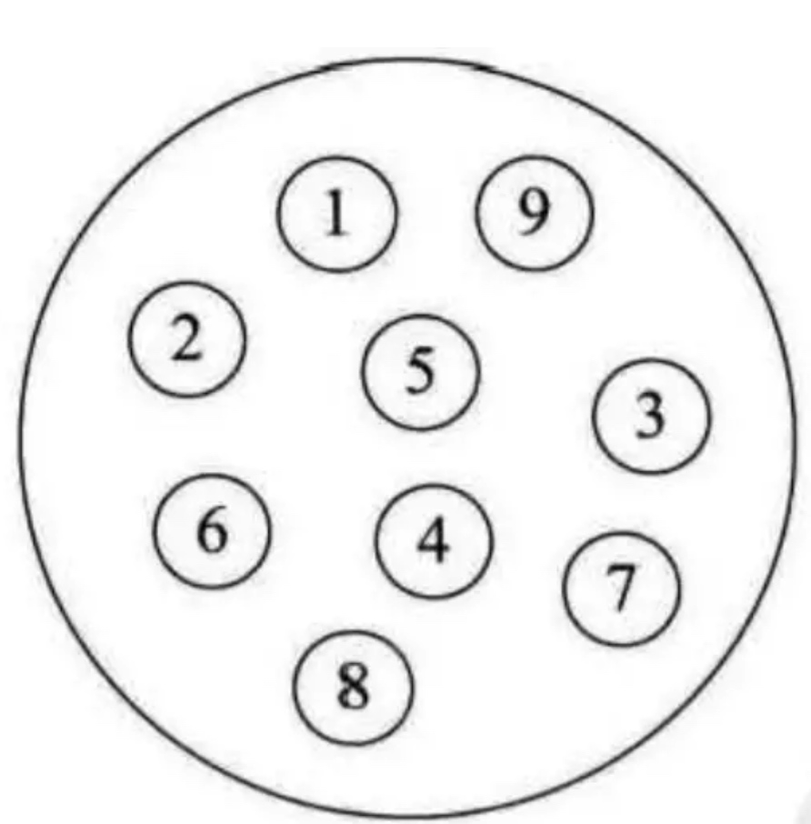
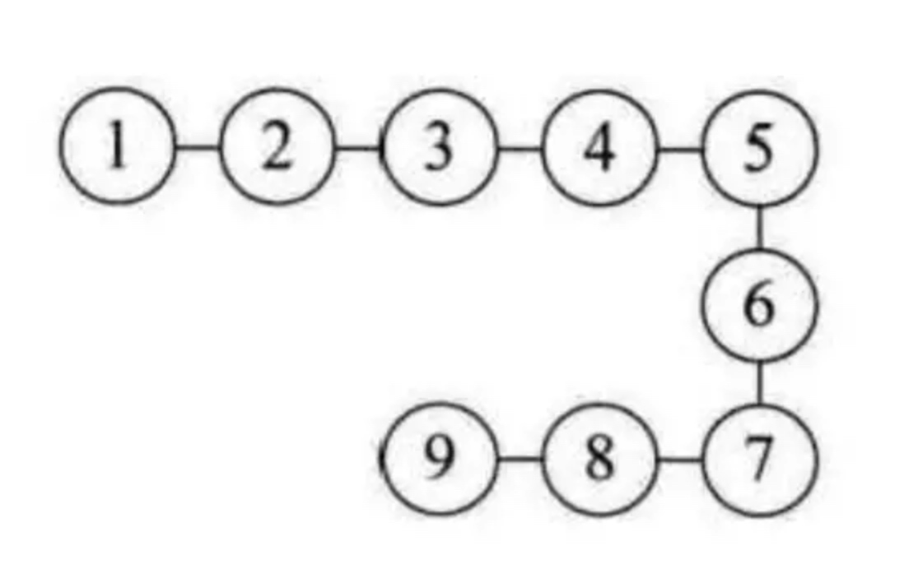
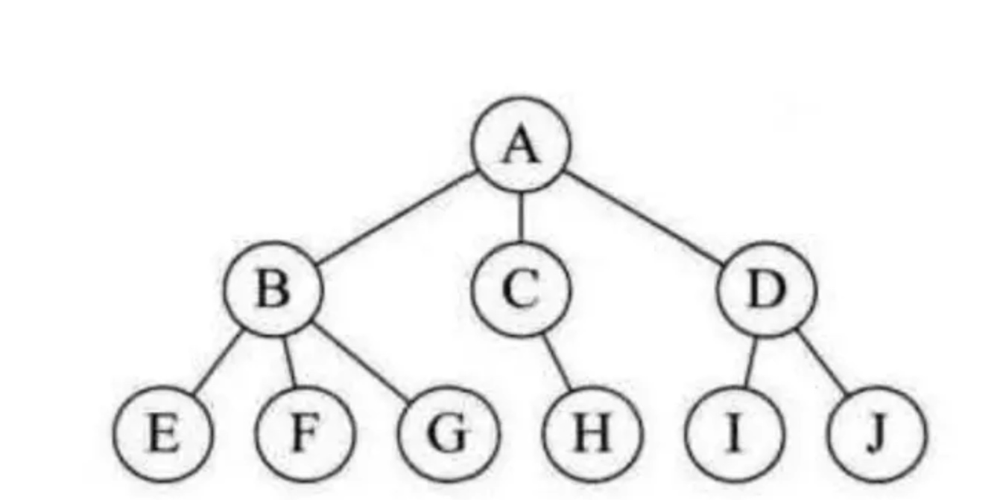
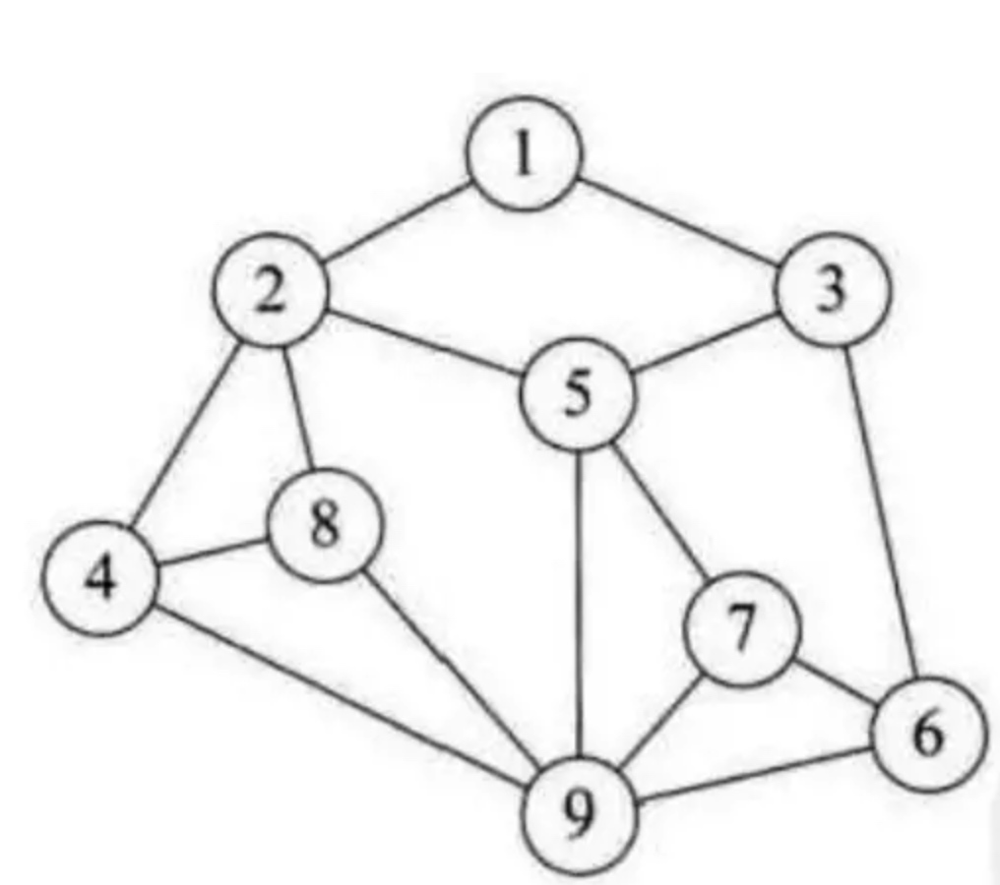
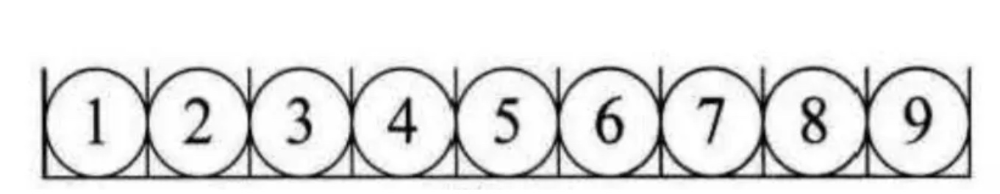
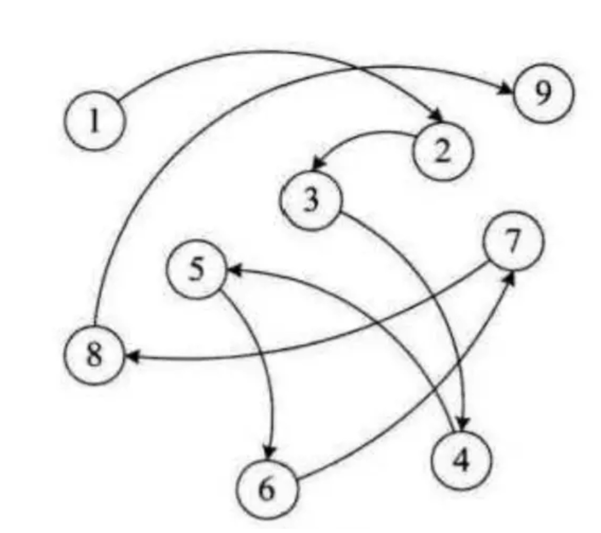

# 数据结构

## 什么数据结构呢？
首先我们先看，什么是数据，什么是结构
### 数据
> **数据**：就是描述客观事物的符号，是计算机中可以操作的对象，能被计算机识别，并输入给计算机处理的**符号集合**
> **数据元素**：是组成数据的，有一定意义的基本单位，在计算机中通常作为整体处理。
> **数据项**：一个数据元素可以由若干个数据项组成，例如
> 
   ```java
   class User{
        //姓名
        private String name;
        //年龄
        private int age;
   }
   ```
   上面所述，User就是数据元素，数据项就是name age等等
> **数据对象**：是性质相同的数据元素集合。

### 结构
>**逻辑结构**: 是指数据对象中数据元素之间的关系。包括集合结构，线性结构，树形结构，图形结构
>> * 集合结构：集合结构中的数据元素除了同属于一个集合外，他们之间没有其他关系


>> * 线性结构：线性结构中的数据之间存在一种 1:1 的层次关系


>> * 树形结构：树形结构中的数据之间存在一种 1:n的层次关系，就像一棵树一样，树干上长树枝，树枝上再长树枝


>> * 图形结构：图形结构中的数据元素是 n:n 的关系



> **物理结构**： 是指数据的逻辑结构在计算机中的存储方式。顺序存储还是链式存储
> > * 顺序存储: 是把数据元素存放在地址连续的存储单元里，数据间的逻辑关系和屋里关系是一致的。
> > 特点是占用连续的内存空间


> > * 链式存储：是把数据元素存放在任意的存储单元李，这组存储单元可以是连续的，也可以是不连续的。数据元素的存储关系并不能反应器逻辑关系，因此需要一个指针存放数据元素的地址，这样通过地址就可以找到相关数据元素的地址。
>> 就像我们做全文检索时，把各个分词做成一个目录，然后内容存放在不同的地址中。搜索只搜索分词，然后通过分词中的目录地址集合显示多种查询结果
>> 特点：数据存储灵活，数据存放在哪并不重要，只要有一个指针存放了相应的地址就能找到它



### 数据结构
数据结构是实例或者值的集合，是相互之间存在一种或多种特定关系的数据元素集合，是一组数据的存储结构,是为了算法服务的


-------

## 常用的数据结构
数组、链表、栈、队列、散列表、二叉树、堆、跳表、图、Tire树

### 线性表
首先先说线性表，线性表就是数据排成像一条线一样的结构。每个线性表上的数据最多只有前和后两个方向。
常用的数据结构中，数组、链表、队列和栈都属于线性表

我们分别说一下这几个数据结构：


##### 数组
用一组连续的内存空间，存储一组具有相同类型的数据

优点：具有随机访问的特性
缺点：删除和插入数据效率低

